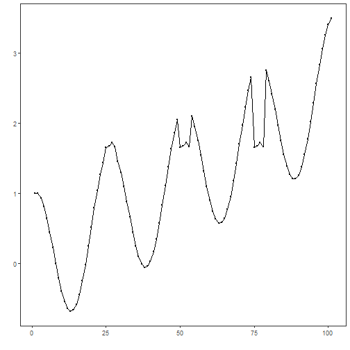
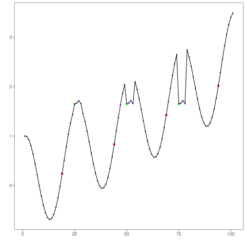

``` r
# Installing Harbinger
install.packages("harbinger")
```


``` r
# Loading Harbinger
library(daltoolbox)
library(harbinger) 
```


``` r
# loading the example database
data(examples_motifs)
```


``` r
# Using the simple time series
dataset <- examples_motifs$simple
head(dataset)
```

```
##       serie event
## 1 1.0000000 FALSE
## 2 0.9939124 FALSE
## 3 0.9275826 FALSE
## 4 0.8066889 FALSE
## 5 0.6403023 FALSE
## 6 0.4403224 FALSE
```


``` r
# ploting the time series
har_plot(harbinger(), dataset$serie)
```




``` r
# establishing method 
  model <- hmo_mp("pmp", 4, 3)
```


``` r
# fitting the model
  model <- fit(model, dataset$serie)
```


``` r
# making detections
  detection <- detect(model, dataset$serie)
```

```
## step: 1/1 binary idx: 1 window: 4
```


``` r
# filtering detected events
  print(detection |> dplyr::filter(event==TRUE))
```

```
##   idx event  type seq seqlen
## 1  19  TRUE motif   3      4
## 2  25  TRUE motif   2      4
## 3  44  TRUE motif   3      4
## 4  50  TRUE motif   2      4
## 5  69  TRUE motif   3      4
## 6  75  TRUE motif   2      4
## 7  94  TRUE motif   3      4
```


``` r
# evaluating the detections
  evaluation <- evaluate(model, detection$event, dataset$event)
  print(evaluation$confMatrix)
```

```
##           event      
## detection TRUE  FALSE
## TRUE      3     4    
## FALSE     0     94
```


``` r
# plotting the results
  har_plot(model, dataset$serie, detection, dataset$event)
```



