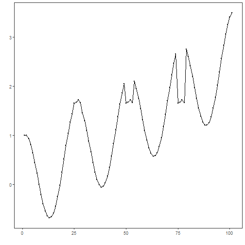
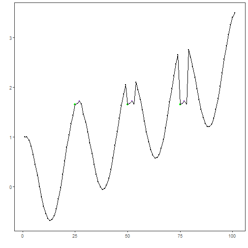

SAX motif discovery: SAX (Symbolic Aggregate approXimation) discretizes z-normalized subsequences into symbolic words using breakpoints derived from a Gaussian distribution. Motifs emerge as frequently occurring words or closely related symbolic patterns. Harbinger wraps SAX-based discovery and returns motif locations for plotting and evaluation.

SAX (Symbolic Aggregate approXimation) maps z-normalized values to symbols; recurring words indicate motifs. In this example we:

- Load and visualize a motif dataset
- Configure `hmo_sax(a, w, qtd)` and run detection
- Inspect and evaluate motif occurrences


``` r
# Install Harbinger (if needed)
#install.packages("harbinger")
```


``` r
# Load required packages
library(daltoolbox)
library(harbinger) 
```


``` r
# Load example motif datasets
data(examples_motifs)
```


``` r
# Select the simple motif dataset
dataset <- examples_motifs$simple
head(dataset)
```

```
##       serie event
## 1 1.0000000 FALSE
## 2 0.9939124 FALSE
## 3 0.9275826 FALSE
## 4 0.8066889 FALSE
## 5 0.6403023 FALSE
## 6 0.4403224 FALSE
```


``` r
# Plot the raw time series
har_plot(harbinger(), dataset$serie)
```




``` r
# Configure SAX-based motif discovery (alphabet=26, word=3, min occurrences=3)
model <- hmo_sax(26, 3, 3)
```


``` r
# Fit the detector (learns binning thresholds)
model <- fit(model, dataset$serie)
```


``` r
# Run motif discovery
detection <- detect(model, dataset$serie)
```


``` r
# Show detected motif starts
print(detection |> dplyr::filter(event == TRUE))
```

```
##   idx event  type seq seqlen
## 1  25  TRUE motif QST      3
## 2  50  TRUE motif QST      3
## 3  75  TRUE motif QST      3
```


``` r
# Evaluate detections against labels
evaluation <- evaluate(model, detection$event, dataset$event)
print(evaluation$confMatrix)
```

```
##           event      
## detection TRUE  FALSE
## TRUE      3     0    
## FALSE     0     98
```


``` r
# Plot motifs and ground truth
har_plot(model, dataset$serie, detection, dataset$event)
```



References 
- Lin, J., Keogh, E., Lonardi, S., Chiu, B. (2007). A symbolic representation of time series, with implications for streaming algorithms. Data Mining and Knowledge Discovery, 15, 107–144.
